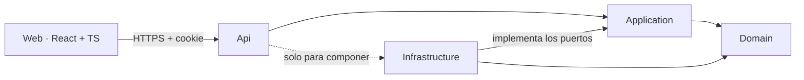

# Tato

Plataforma SaaS multi-tenant para la gestión de estudios de tatuajes.

La primera entrega es el **blog y portfolio público** de cada estudio. Sobre la misma base llega después el **MVP de gestión**: agenda, señas, clientes, tatuajes y sesiones.

> **Estado:** en desarrollo. Versión 1 (blog) online antes del **17 de noviembre de 2026** (D-46).

---

## Qué es

Cada estudio que usa la plataforma es un *tenant* aislado: sus usuarios, contenido y datos no son visibles para ningún otro estudio. El primer estudio en usarla es el estudio piloto, que funciona como tester del producto.

### Versión 1 · Blog y portfolio

- **Sitio público** del estudio: inicio, galería de trabajos con filtros, detalle de cada trabajo, diseños disponibles, perfiles de tatuadores y contacto por WhatsApp e Instagram.
- **Panel privado** con login, diseñado primero para el celular: publicaciones, diseños y perfiles del estudio y de los tatuadores.
- **Fotos optimizadas** al subirlas (tamaño de galería, de detalle y miniatura). El sitio nunca sirve los originales.
- **Vistas previas y SEO**: cada página pública sale con título, descripción y foto (Open Graph), más un sitemap.
- **Base del sistema**: login, estudios, usuarios y aislamiento por estudio, que después reutiliza el MVP.

### Después

- MVP de gestión: Agenda y Turnos con señas, Clientes, Tatuajes, Sesiones con walk-ins y notificaciones in-app.
- «Publicar en blog» desde un tatuaje finalizado, pedido de turno desde el sitio y alta de estudios por autoservicio.
- Integraciones con Mercado Pago y WhatsApp.

---

## Stack

| Capa | Tecnología |
| --- | --- |
| Backend | ASP.NET Core Web API con controladores · .NET 10 LTS · OpenAPI nativo + Scalar |
| Datos | SQL Server 2025 · EF Core 10, code-first con migraciones |
| Autenticación | ASP.NET Core Identity con cookie HttpOnly |
| Validación | FluentValidation para la entrada; las reglas de negocio viven en el dominio |
| Frontend | React 19.2 + TypeScript · Vite 8 · Node 24 LTS · pnpm |
| Interfaz | Tailwind CSS + shadcn/ui |
| Front: ruteo, datos y formularios | React Router · TanStack Query · React Hook Form + Zod |
| Cliente de la API | Generado desde OpenAPI con Orval |
| Archivos | Puerto de almacenamiento: disco local en desarrollo; disco del servidor o almacenamiento de objetos en producción |
| Tests | xUnit + Testcontainers · Vitest + Testing Library · tests de arquitectura |

No se usan MediatR, AutoMapper ni Fluent Assertions: cambiaron a licencias comerciales y no hacen falta. Para mapear, a mano o con Mapperly.

---

## Arquitectura

**Clean Architecture en un monolito modular** (D-37, D-38): un solo despliegue, dividido en módulos de negocio con fronteras claras. El dominio está en el centro y las dependencias apuntan siempre hacia adentro.



| Proyecto | Responsabilidad | Depende de |
| --- | --- | --- |
| `Tato.Domain` | Entidades, objetos de valor, estados, eventos de dominio y reglas RN. Sin paquetes externos. | Nada |
| `Tato.Application` | Casos de uso, puertos (interfaces), validación de entrada, autorización por recurso y DTOs. | Domain |
| `Tato.Infrastructure` | EF Core, Identity, almacenamiento de archivos, adaptadores externos y tareas automáticas. | Application, Domain |
| `Tato.Api` | Controladores, autenticación, middleware, OpenAPI y composición de dependencias. | Application; Infrastructure solo para componer |

### Reglas que no se rompen

- **El dominio no conoce nada externo**: ni EF Core, ni ASP.NET, ni proveedores. Habla con puertos; la infraestructura los implementa con adaptadores.
- **Un módulo no toca las tablas ni las clases internas de otro**: se comunica con casos de uso o eventos. Los tests de arquitectura lo verifican y la CI falla si alguien lo rompe.
- **Multi-tenancy** (D-42): una sola base con `EstudioId` en todas las tablas del estudio. El estudio sale de la sesión autenticada, nunca de un dato que mande el navegador. Filtros de consulta con nombre de EF Core más Row-Level Security de SQL Server como segunda línea de defensa.
- **Fechas en UTC** (D-43): se muestran en la zona horaria del estudio (`America/Argentina/Buenos_Aires` por defecto), en formato dd/mm/aaaa y 24 h. El reloj se obtiene siempre de `TimeProvider`, nunca de `DateTime.Now`.
- **Concurrencia optimista**: las entidades que editan varios usuarios llevan `rowversion`.
- **Sin borrados operativos**: el contenido cambia de estado (por ejemplo, Publicada → Oculta) y queda en el historial.

### Módulos

| Módulo | Contenido | Entrega |
| --- | --- | --- |
| Estudios | Estudios (tenants), usuarios, roles, perfiles y configuración del estudio | v1 |
| Portfolio | Publicaciones, diseños, perfiles públicos y fotos | v1 |
| Clientes · Agenda · Tatuajes · Notificaciones | Gestión operativa del estudio | MVP |
| Pagos | Integración con Mercado Pago | Post-MVP |

Cada módulo es una carpeta dentro de cada proyecto (`Tato.Domain/Portfolio`, `Tato.Application/Portfolio`, etc.).

### Sitio público y vistas previas

WhatsApp, Instagram y Facebook no ejecutan JavaScript para armar la vista previa de un link. Por eso la API entrega el HTML de cada página pública con su título, descripción y foto ya cargados (Open Graph) y genera el sitemap. Los endpoints públicos son de solo lectura y con caché; los del panel usan la cookie de sesión.

---

## Estructura del repositorio

```
tato-saas/
├── backend/
│   ├── Tato.slnx
│   ├── global.json                  # fija el SDK de .NET 10
│   ├── .config/dotnet-tools.json    # dotnet-ef como herramienta local
│   ├── src/
│   │   ├── Tato.Domain/
│   │   ├── Tato.Application/
│   │   ├── Tato.Infrastructure/
│   │   └── Tato.Api/
│   └── tests/
│       ├── Tato.Domain.Tests/
│       ├── Tato.IntegrationTests/   # xUnit + Testcontainers, contra SQL Server real
│       └── Tato.ArchitectureTests/  # dependencias y fronteras entre módulos
├── frontend/
│   ├── pnpm-workspace.yaml
│   ├── apps/
│   │   ├── sitio/                   # sitio público del estudio (www)
│   │   └── panel/                   # panel privado (subdominio panel); crece hasta ser la app del MVP
│   └── packages/
│       ├── ui/                      # componentes compartidos (Tailwind + shadcn/ui)
│       └── api-client/              # cliente generado desde OpenAPI
├── docs/                            # requerimientos (docs 01 a 07) y planillas
├── .github/                         # CI y Dependabot
├── .editorconfig
├── .nvmrc                           # Node 24
└── README.md
```

En el front, el código de cada app se organiza por funcionalidad (`src/features/publicaciones`, `src/features/disenos`, …), no por tipo de archivo.

---

## Primeros pasos

### Requisitos

- [.NET 10 SDK](https://dotnet.microsoft.com/download)
- Node.js 24 LTS (la versión está fijada en `.nvmrc`) y pnpm
- SQL Server 2025 (alcanza con una instancia local)
- Docker, para los tests de integración
- Recomendado: VS Code con C# Dev Kit y la extensión MSSQL

### Backend

```bash
cd backend
dotnet restore
dotnet tool restore

# Cadena de conexión local, fuera del repositorio
dotnet user-secrets set "ConnectionStrings:Tato" \
  "Server=localhost;Database=Tato_Dev;User Id=<usuario>;Password=<contraseña>;TrustServerCertificate=True" \
  --project src/Tato.Api

# Crear o actualizar la base
dotnet ef database update --project src/Tato.Infrastructure --startup-project src/Tato.Api

# Levantar la API (la documentación interactiva de Scalar queda disponible en desarrollo)
dotnet run --project src/Tato.Api
```

### Frontend

```bash
cd frontend
pnpm install

pnpm --filter sitio dev      # sitio público
pnpm --filter panel dev      # panel privado
pnpm api:generate            # regenera el cliente tipado desde el OpenAPI de la API
```

En desarrollo, Vite hace de proxy de `/api` hacia la API, así la cookie de sesión es del mismo origen y no hace falta configurar CORS.

### Tests

```bash
cd backend && dotnet test    # requiere Docker corriendo (Testcontainers)
cd frontend && pnpm test
```

---

## Configuración

Nada hardcodeado (D-34):

- **Parámetros de negocio**: viven en la configuración de cada estudio, en la base, con valores por defecto (por ejemplo, el máximo de fotos por publicación, 10 por defecto). Nunca en el código.
- **Parámetros técnicos**: `appsettings.json` tipados con el patrón Options.
- **Secretos**: nunca en el repositorio. `dotnet user-secrets` en desarrollo; variables de entorno en producción.
- **Front**: variables en `.env.local` (ignorado por git), con un `.env.example` versionado como referencia. Todo lo que llega al front es público: ahí no van secretos.

---

## Convenciones

**Idioma.** El dominio usa el vocabulario del glosario (doc 05): `Publicacion`, `Diseno`, `Estudio`, `Turno`, `Sena`. Sin ñ ni tildes en los identificadores.

**Ramas.** `main` siempre está desplegable y protegida. El trabajo va en ramas cortas (`feat/…`, `fix/…`, `docs/…`) y entra por pull request, para que corra la CI.

**Commits.** [Conventional Commits](https://www.conventionalcommits.org/es/) en español, con el módulo como alcance. Si el cambio implementa o modifica una regla o decisión, se cita su identificador:

```
feat(portfolio): exigir consentimiento antes de publicar (RN-BLG-03)
fix(estudios): tomar el EstudioId de la sesión y no del pedido
docs: cerrar P-18 con el hosting elegido
```

**Identificadores de la documentación.** `RN-xxx` regla de negocio · `D-xx` decisión · `P-xx` pendiente · `R-xx` punto a revisar del modelo de datos.

**Formato.** `dotnet format` en el backend y el linter de la plantilla de Vite en el front, ambos validados en la CI.

---

## Hoja de ruta de la versión 1

- [ ] **Semana 1** (5 al 11/10): repositorio, entorno, hosting y dominio (corte 0)
- [ ] **Semana 2** (12 al 18/10): login, estudios, usuarios y aislamiento por estudio (corte 1) · primer despliegue
- [ ] **Semana 3** (19 al 25/10): panel de publicaciones, con subida y optimización de fotos
- [ ] **Semana 4** (26/10 al 1/11): sitio público: inicio, galería, detalle y contacto por WhatsApp
- [ ] **Semana 5** (2 al 8/11): diseños, tatuadores, vistas previas y SEO
- [ ] **Semana 6** (9 al 15/11): carga del contenido real, pruebas en celulares y ajustes, sin funciones nuevas
- [ ] **16/11**: margen

Si el plan se atrasa, se recorta en este orden: diseños, filtros de la galería y perfiles de tatuadores. Lo indispensable es el inicio, la galería, el detalle, el contacto y el panel de carga.

---

## Despliegue

Propuesta por defecto (P-18, ver `docs/`): un servidor virtual con SQL Server Express, Cloudflare adelante para DNS, CDN y HTTPS, y el dominio del estudio con el sitio en `www` y el panel en el subdominio `panel`. El primer despliegue se hace en la semana 2, para que los problemas del hosting aparezcan temprano.

---

## Documentación

| Documento | Contenido |
| --- | --- |
| 01 · Visión, alcance y roles | Qué es el producto, alcance, roles y matriz de permisos |
| 02 · Reglas de negocio generales | Tatuajes, co-tatuadores, sesiones, visibilidad, clientes y notificaciones |
| 03 · Módulo Agenda y Turnos | Calendario, señas, turnos, estados, reagendamientos y montos |
| 04 · Modelo de datos | Entidades y relaciones (borrador) |
| 05 · Decisiones, glosario y pendientes | Por qué se decidió cada cosa y temas abiertos |
| 06 · Stack y arquitectura | Tecnologías, arquitectura, seguridad, escalabilidad y patrones |
| 07 · Blog y portfolio público | Requerimientos de la primera entrega |

Los documentos 02, 03 y 07 son la fuente de verdad de las reglas de negocio. Si el código y la documentación no coinciden, se corrige uno de los dos en el mismo pull request.

---

## Licencia

Software privado. Todos los derechos reservados.
